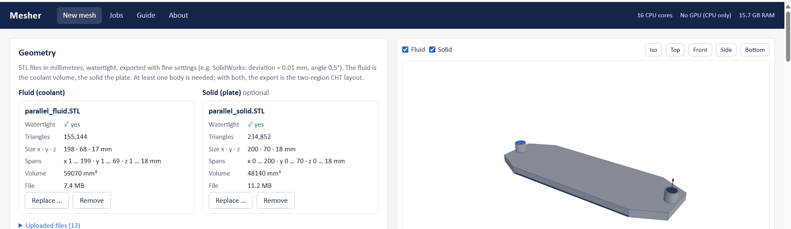
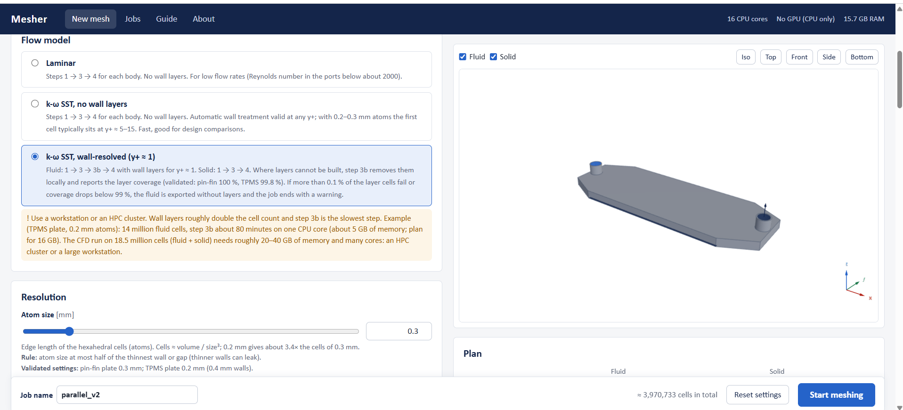
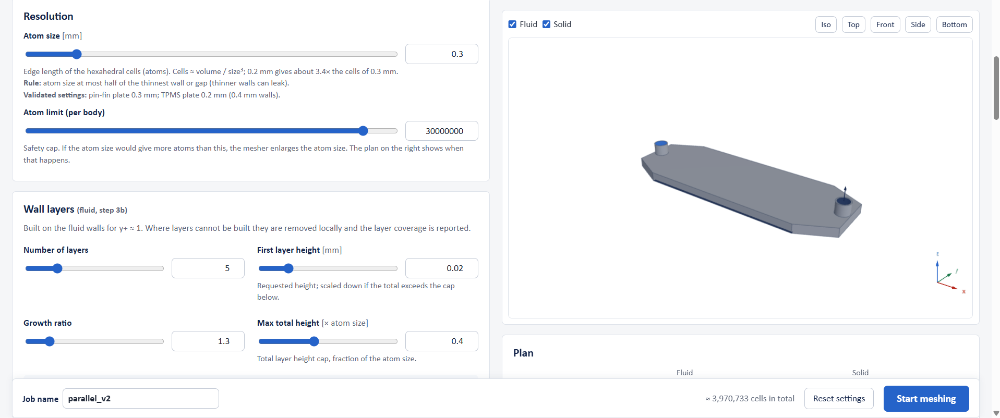
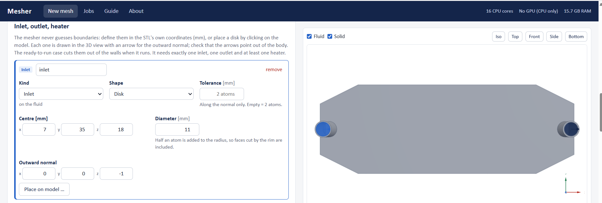
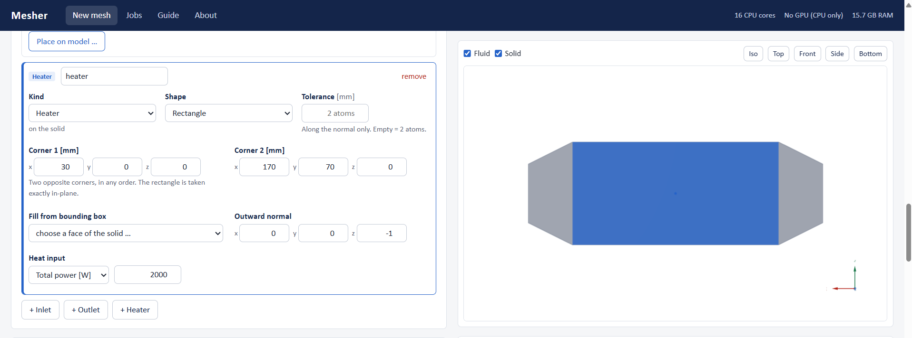
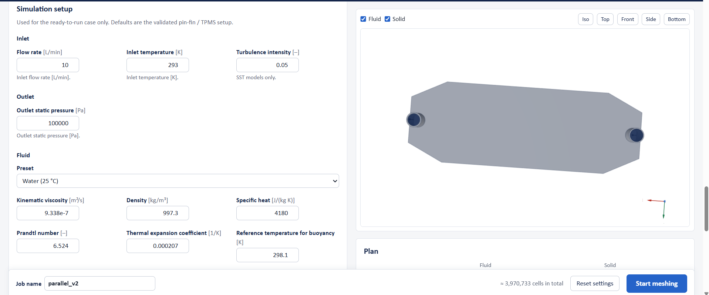
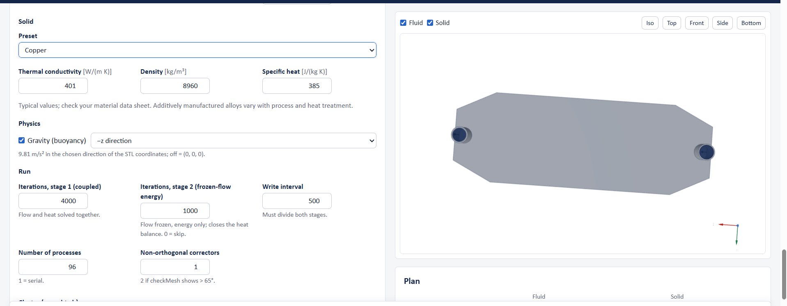
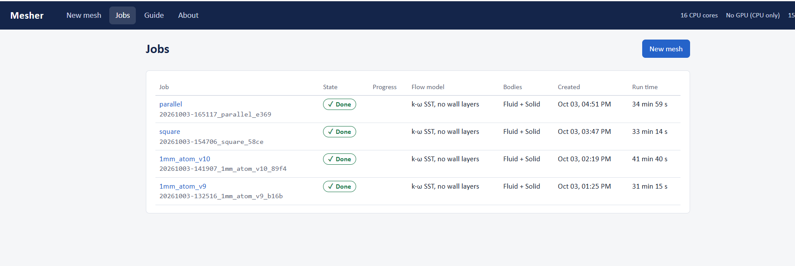
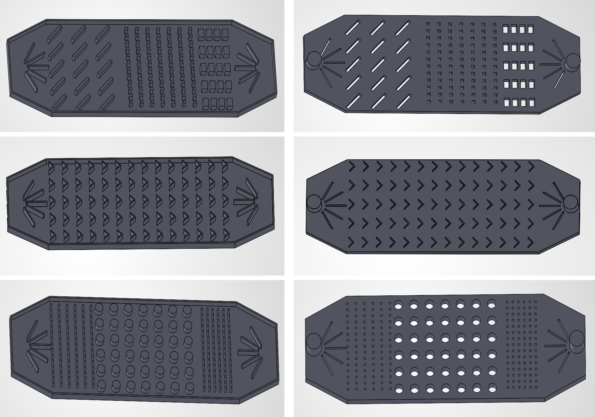
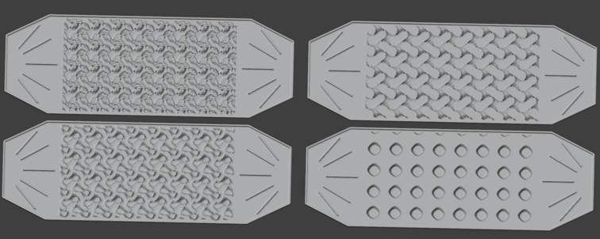

# AtomMesh: All-Hex CHT Mesher for Watertight Geometries

Automatic, ML-assisted all-hexahedral meshing pipeline for conjugate heat transfer (CHT) simulations of watertight geometries. The pipeline converts fluid and solid STL geometries into a two-region OpenFOAM mesh with boundary-layer resolution and generates a ready-to-run CHT simulation case. It turns a fluid STL and a solid STL into a two-region OpenFOAM mesh with wall-resolved boundary layers and writes a ready-to-run `chtMultiRegionSimpleFoam` case.

> **Status:** the code is not public. A live demo is available on request.
> Contact: pvraditya.srt@gmail.com · [LinkedIn](https://www.linkedin.com/in/pvraditya/)

## Why

During my M.Sc. thesis (graph neural network surrogates for cold-plate cooling, RWTH Aachen) I needed solver-ready meshes of TPMS lattices and pin-fin plates. Standard open-source meshing struggles with thin, strongly curved lattice walls, so I built my own pipeline.

## How it works

1. **Atoms.** Each body is cut into cubic cells ("atoms") of one size. The solid uses the same lattice as the fluid.
2. **Snapping.** A graph neural network moves the boundary nodes onto the CAD surface; a Jacobian guard keeps every cell valid.
3. **Wall layers.** Five hexahedral layers at every fluid wall for y+ below 1. Where a layer cell cannot be made valid, layers are removed locally and the coverage is reported.
4. **Export.** OpenFOAM polyMesh for both regions. Every solid interface node takes the position of the matching fluid node, so both regions share identical interface faces.
5. **Case set-up.** Inlet, outlet and heater patches, materials, solver settings, and run scripts for a cluster (Slurm) and a workstation.

Flow models: laminar · k-ω SST without wall layers · k-ω SST wall-resolved (y+ ≈ 1).

The pipeline runs from a local desktop app (Python backend, 3D browser interface): upload STLs, place patches on the model, check the cell-count plan, start meshing, download the case.

### Screenshots

| | |
| --- | --- |
|  |  |
|  |  |
|  |  |
|  |  |

## Validation (7 cold plates)

Four pin-fin arrays (chevron, cylinder, parallel, square; 0.3 mm atoms) and three TPMS lattices (gyroid, Lidinoid, Neovius; 0.2 mm atoms). Water at 10 L/min, 2000 W heater, copper plate, k-ω SST, OpenFOAM v2312.

### Designs

Pin-fin arrays (from the thesis design set):

TPMS lattices:

The validation used four pin-fin plates (chevron, cylinder, parallel, square) and three TPMS plates (gyroid, Lidinoid, Neovius). The Schwarz TPMS was excluded because its fluid STL contains sealed internal pockets.

### Results

| Result | Acceptance limit | Achieved |
| --- | --- | --- |
| checkMesh verdict | "Mesh OK" in every region | 14 of 14 regions |
| Inverted cells | 0 | 0 |
| Max non-orthogonality | ≤ 70° | 49.9–69.5° |
| Max skewness (OpenFOAM) | ≤ 4 | 3.44–3.56 |
| Mean first-cell y+ | < 1 | 0.40–0.60 |
| Wall-layer coverage | ≥ 99 % | 99.8–100 % |
| Solid / fluid volume vs CAD | ≤ 2 % / ≤ 1 % | ≤ 0.32 % / ≤ 0.20 % |
| Interface heat error | ≤ 1 % | 0.000–0.13 % |
| Heater power reaching the coolant | within 1 % | 99.99–100.12 % |

Mesh sizes: 6.1–6.6 million cells (pin-fin), 16.4–18.5 million (TPMS). Meshing time on one GPU node: 6–10 min (pin-fin), 33–111 min (TPMS).

**Matched interface.** Meshing the solid on the fluid's grid reduced the interface heat error from up to 7.4 % to 0.13 % or less.

**Comparison with SimScale** (parallel pin-fin, same geometry and boundary conditions): peak heater temperature within 1.3 K (6 % of the temperature rise above the inlet). Pressure drop is 0.66 kPa higher and average heater temperature 2.9 K lower with this mesher, consistent with its resolved boundary layer (y+ 0.4) and second-order schemes.

Full report: [All-Hex CHT Mesher: Validation Results (PDF)](docs/All-Hex_CHT_Mesher_Validation_Results.pdf) · data: [validation_results.xlsx](docs/validation_results.xlsx)

## Scope and limitations

- Steady, single-phase CHT of internal flows (cold plates, heat exchangers).
- One cell size per mesh (no local refinement), so meshes are large.
- Walls and gaps must be at least two atoms thick.
- STLs must be watertight and free of sealed internal voids.
- Open checks: mesh independence and wall-layer transition study; comparison with measurements.

## Author

Venkata Rama Aditya Philkhana — simulation engineer (CFD, conjugate heat transfer, graph neural networks).
